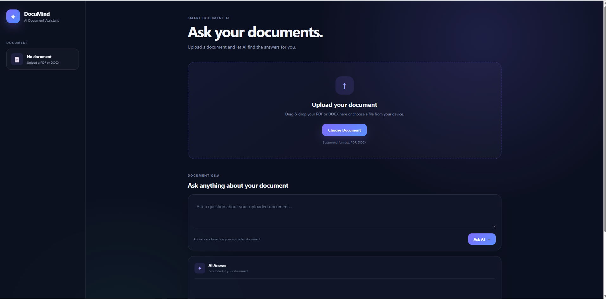
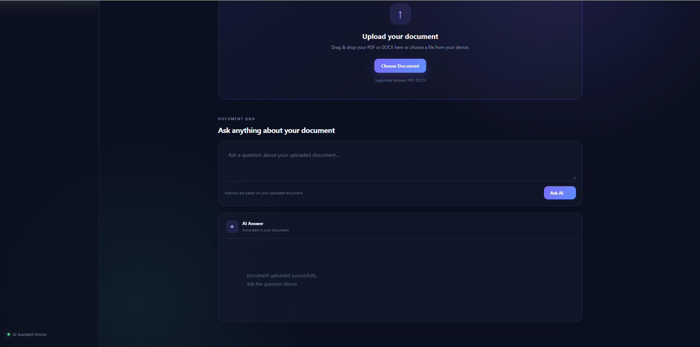
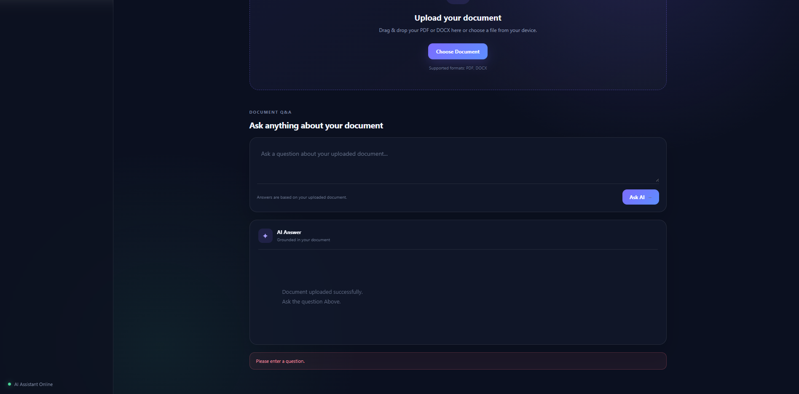
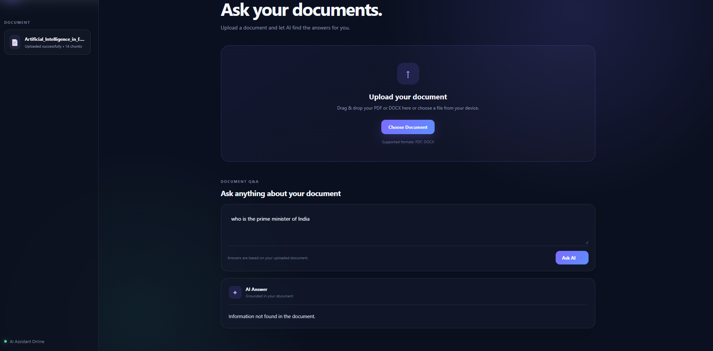
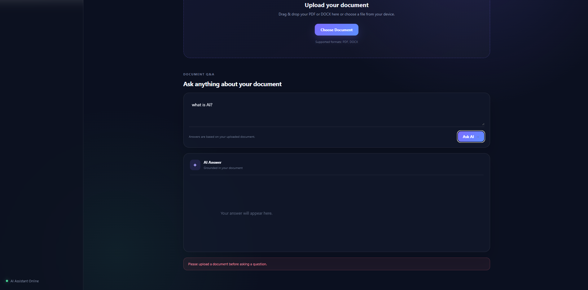

# Smart Document AI Assistant

An AI-powered document question-answering application that allows users to upload PDF or DOCX documents and ask questions about their content.

The application extracts text from uploaded documents, divides the text into smaller overlapping chunks, generates vector embeddings using FastEmbed, searches for relevant information using FAISS, and uses a Groq-powered LLM to generate answers based only on the uploaded document.

## Live Demo

[Open Smart Document AI Assistant](https://smart-document-ai-assistant.onrender.com)

## GitHub Repository

[Smart Document AI Assistant](https://github.com/AnjanaPujari/Smart-Document-AI-Assistant)

## Features

- Upload PDF documents
- Upload DOCX documents
- Automatic text extraction
- Text chunking with overlapping chunks
- Semantic document search
- FastEmbed-based embeddings
- FAISS vector similarity search
- AI-powered question answering
- Answers grounded in the uploaded document
- Handles questions whose answers are not present in the document
- Empty question validation
- Invalid file type validation
- Loading state
- Error handling
- Drag-and-drop document upload
- Responsive user interface
- Modern dark-themed UI
- Production deployment using Render

## How It Works

The application follows a Retrieval-Augmented Generation (RAG) style workflow.

```text
User
  ↓
Upload PDF / DOCX
  ↓
Text Extraction
  ↓
Text Chunking
  ↓
FastEmbed
  ↓
Vector Embeddings
  ↓
FAISS Similarity Search
  ↓
Top Relevant Document Chunks
  ↓
Groq LLM
  ↓
Document-Based Answer
  ↓
User
```

## Technology Stack

### Backend

- Python
- FastAPI
- Uvicorn
- PyPDF
- python-docx

### AI / Machine Learning

- FastEmbed
- sentence-transformers/all-MiniLM-L6-v2
- FAISS
- LangChain Groq
- Groq LLM

### Frontend

- HTML5
- CSS3
- JavaScript

### Deployment

- GitHub
- Render

## Project Structure

```text
Smart-Document-AI-Assistant/
│
├── frontend/
│   ├── index.html
│   ├── style.css
│   └── script.js
│
├── screenshots/
│   ├── dashboard-1.png
│   ├── dashboard-2.png
│   ├── upload-1.png
│   ├── upload-success.png
│   ├── answer.png
│   ├── empty-question.png
│   ├── not-found.png
│   └── no-document.png
│
├── main.py
├── requirements.txt
├── README.md
└── .gitignore
```

## Application Workflow

### 1. Document Upload

The user uploads a PDF or DOCX document through the web interface.

The FastAPI `/upload` endpoint receives and processes the file.

Only PDF and DOCX files are accepted.

### 2. Text Extraction

For PDF files, text is extracted using PyPDF.

For DOCX files, text is extracted using python-docx.

The application also extracts text contained inside DOCX tables.

### 3. Text Chunking

The extracted text is divided into smaller overlapping chunks.

Current configuration:

- Chunk size: 250 characters
- Overlap: 50 characters

The overlap helps preserve context between neighboring chunks.

### 4. Embedding Generation

Each document chunk is converted into a numerical vector using:

```text
sentence-transformers/all-MiniLM-L6-v2
```

through FastEmbed.

The embedding dimension is:

```text
384
```

The embeddings are normalized before being stored in the FAISS index.

### 5. FAISS Similarity Search

The application uses:

```text
FAISS IndexFlatIP
```

for vector similarity search.

When a user asks a question:

1. The question is converted into an embedding.
2. The embedding is normalized.
3. FAISS searches the document vectors.
4. The top 3 relevant chunks are retrieved.
5. The retrieved chunks are provided to the LLM as context.

### 6. AI Answer Generation

The retrieved document chunks are provided to the Groq LLM.

The model is instructed to use only the retrieved document context and not outside knowledge.

The application uses:

```text
openai/gpt-oss-20b
```

with temperature set to `0`.

If the required information is not available in the retrieved context, the application instructs the model to return:

```text
Information not found in the document.
```

## Screenshots

### Main Dashboard




### Document Upload


### Document Uploaded Successfully



### AI Question Answering


### Empty Question Handling



### Question Not Found in Document



### Question Asked Without Uploading Document



## API Endpoints

### GET `/`

Serves the main DocuMind web application.

### GET `/app`

Alternative route for serving the frontend application.

### GET `/status`

Checks whether the backend server is running.

### POST `/upload`

Uploads and processes a PDF or DOCX document.

### POST `/search`

Accepts a question, retrieves relevant document chunks, and generates an AI-powered answer.

## Local Setup

### 1. Clone the repository

```bash
git clone https://github.com/AnjanaPujari/Smart-Document-AI-Assistant.git
```

### 2. Navigate to the project

```bash
cd Smart-Document-AI-Assistant
```

### 3. Create a virtual environment

Windows:

```bash
python -m venv venv
```

### 4. Activate the virtual environment

Windows PowerShell:

```bash
venv\Scripts\Activate.ps1
```

### 5. Install dependencies

```bash
pip install -r requirements.txt
```

### 6. Configure the Groq API key

Create an environment variable named:

```text
GROQ_API_KEY
```

Do not place the API key directly inside the source code.

### 7. Start the application

```bash
uvicorn main:app --reload
```

### 8. Open the application

```text
http://127.0.0.1:8000
```

## Environment Variables

The application requires:

```text
GROQ_API_KEY=your_groq_api_key
```

For production deployment, the API key should be stored securely as an environment variable in Render.

## Deployment

The application is deployed using Render.

The GitHub repository is connected to the Render service, allowing new commits pushed to the `main` branch to trigger a new deployment.

The production application is accessible through the Render deployment URL.

## Security

The Groq API key is stored as an environment variable and is not included in the source code.

Never commit API keys or other sensitive credentials to GitHub.

The `.gitignore` file is used to prevent sensitive and unnecessary files from being committed.

## Testing

The application has been tested for the following cases:

- PDF upload
- DOCX upload
- Questions with answers present in the document
- Questions whose answers are not present in the document
- Empty questions
- Invalid file types
- Loading state
- Error handling
- Document processing
- AI answer generation
- Production deployment
- Frontend and backend communication

## Current Limitations

- Only one active document is handled at a time.
- Uploading another document replaces the current FAISS index.
- Scanned or image-only PDFs may not produce readable text because OCR is not currently implemented.
- Answer quality depends on the quality of extracted text and retrieved chunks.
- The application is designed primarily for relatively small documents.
- The free deployment environment has limited memory and processing resources.

## Future Improvements

- Multiple document support
- Document management and deletion
- OCR support for scanned documents
- Improved semantic chunking
- Conversation history
- User authentication
- Source citations for generated answers
- Document preview
- Streaming AI responses
- Cloud-based document storage
- Improved scalability for larger documents

## Why This Project?

Large documents can contain a significant amount of information, making manual searching time-consuming.

Smart Document AI Assistant provides a simple interface where users can upload a document and ask questions in natural language.

Instead of relying only on keyword matching, the application uses semantic embeddings and vector similarity search to retrieve relevant parts of the document before generating an AI-powered answer.

## Author

**Anjana Pujari**

AIML Engineering Student

GitHub:

https://github.com/AnjanaPujari